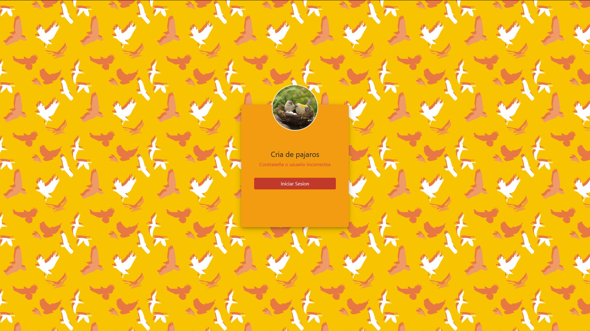
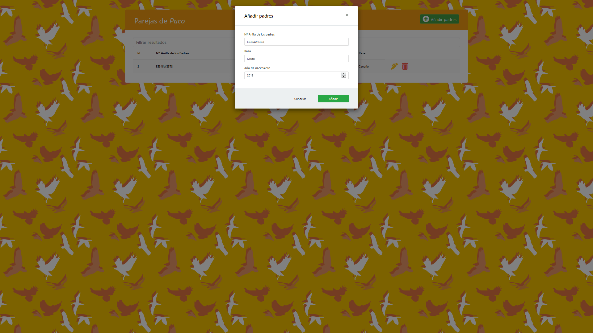
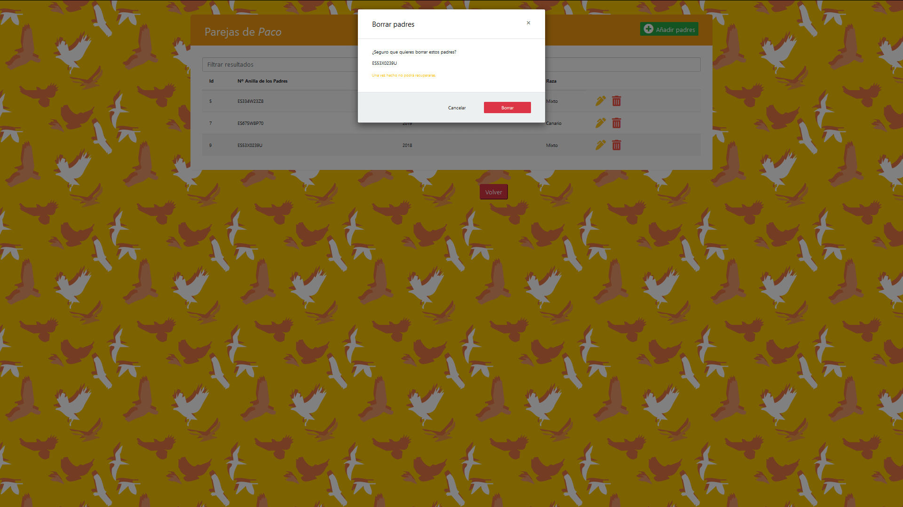

# Gestión de cría de aves :hatching_chick:

El proyecto tratará sobre la gestión de cría de aves en la que se hará el registro de las parejas usadas y las crías nacidas.

El objetivo de este proyecto es informatizar la recogida de estos datos para facilitar el acceso a los ornitólogos ya
que a día de hoy algunos siguen usando libretas para llevar el seguimiento de la cría.

## Índice 
1. [Base de datos utilizada](#id1) 
2. [Página principal](#id2)
3. [Registro de nuevo usuario](#id3)
4. [Inicio de sesión](#id4)
5. [Menú principal](#id5)
6. [Tabla padres](#id6)
    * 6.1 [Añadir padres](#id6.1)
    * 6.2 [Actualizar padres](#id6.2)
    * 6.3 [Filtrar padres](#id6.3)
    * 6.4 [Borrar padres](#id6.4)
7. [Tabla crías](#id7)
    * 7.1 [Añadir crías](#id7.1)
    * 7.2 [Actualizar crías](#id7.2)
    * 7.3 [Filtrar crías](#id7.3)
    * 7.4 [Borrar crías](#id7.4)
 

## 1. Base de datos utilizada 
  

## 2. Página principal 
En ella podemos ver el botón de inicio de sesión y un link para iniciar el registro de un nuevo usuario.  
*index.jsp*  

  

## 3. Registro de nuevo usuario 
Consta de un formulario que pide nombre de usuario, contraseña y repetir dicha contraseña.  
*registro.jsp*  

  

En caso de que se introduzcan mal los datos se puede volver a intentar o volver a la pagina de inicio de sesión.  
*validaregistro.jsp*  

  

Si se completa de forma adecuada el registro se presentara un mensaje que lo confirme y se podra volver a la página de incio de sesión. 
*validaregistro.jsp*  

  

## 4. Inicio de sesión 
Se pide al usuario el nombre y la contraseña y tambien acceso al link de registro.  
*iniciodesesion.jsp*  

  

Si se introducen mal los datos saldrá un mensaje de error y se podra volver a intentar. 

  

## 5. Menú principal 
Una vez hecho correctamente el inicio de sesión se nos presenta un menú que nos da acceso a la tabla Padres, Crías y al cierre de sesión.  
Además cada una de las tablas cuenta con un botón volver que devuelve al usuario al menú principal.  

  

Cualquier intento de acceder a las tablas sin haber iniciado sesión anteriormente redirigirá a la pagina de inicio de sesión.  

## 6. Tabla padres 
En ella se guardan las distintas parejas de padres: el número de anilla de los padres, el año de nacimiento y la raza.  
*padres.jsp*  

  

### 6.1 Añadir padres
Es tan fácil como darle al botón verde de Añadir padres.  
*anadirpadres.jsp*  

  

  

### 6.2 Actualizar padres 
Dándole al icono del bolígrafo amarillo se pueden editar las parejas de padres.  
*actualizarpadres.jsp*  

  

### 6.3 Filtrar padres 
Mediante un campo de búsqueda se pueden filtrar las parejas de padres por sus distintos campos.  

  

### 6.4 Borrar padres 
Haciendo click sobre el icono de la papelera roja se pueden borrar los padres.  
*borrarpadres.jsp*  

  

  

## 7. Tabla crías 
En esta tabla se guardan las crías de los padres anteriormente registrados, añadiendo los siguientes datos: su número de anilla, el color, el sexo, si nació, murió, fue apartado o vendido y el número de anilla de los padres.  
*crias.jsp*  

  

### 7.1 Añadir crías 
Usa el mismo botón que la tabla padres y además se pide el número de anilla de los padres mediante una lista desplegable en la que aparecen las anillas ya registradas.  
*anadircrias.jsp*  

  

### 7.2 Actualizar crías 
*actualizarcrias.jsp*  

  

### 7.3 Filtrar crías 
Al igual que los padres se pueden filtrar las crías por campos mediante un campo de búsqueda.  

  

### 7.4 Borrar crías 
*borrarcrias.jsp*  

  

  

